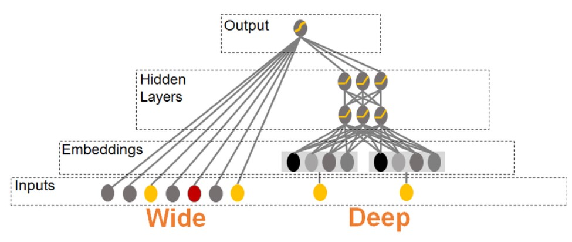

# Which one is better - Deep or Wide Neural Network?

## Introduction
There is a persistent argument over whether neural networks should be deep or wide. A neural network's performance and capacities are greatly influenced by its design and architecture. In this blog, we compare deep neural networks (DNNs) and wide neural networks (WNNs), examining their differences, advantages, and disadvantages. So let's start this adventure to find out which strategy is best.

                                 (HARSHIT KAPOOR, 2020)

## Deep Neural Network (DNN)
Networks with numerous hidden layers between the input and output layers are referred to as deep neural networks. The network is able to learn hierarchical representations of the input data thanks to these layers. Natural language processing, audio recognition, and image categorisation are just a few examples where DNNs are particularly useful. DNNs' depth enables them to automatically extract complicated hierarchical characteristicsand product accurate predictions.

## Wide Neural Network (WNN)
Wide neural networks, as opposed to DNNs, concentrate on boosting the width, or the number of neurones within each layer. WNNs can efficiently capture more diverse information and learn complex decision boundaries by increasing the network's capacity. When the data shows non-linear relationships or when memorisation is required for the task, WNNs perform exceptionally well. They've had success with things like regression issues, anomaly detection, and recommendation systems.

## Which one to use?
1. DNNs is best suited when processing with large-scale datasets, where they can learn complicated relationships and features. However, users need to be careful with the computational time and resources to capture all datasets. 
2. WNNs is more suitable when the dataset is relatively small or when there is a need to capture fine-grained details.

