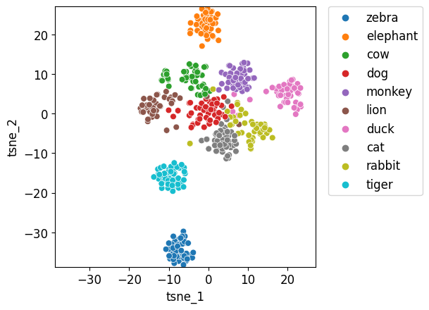

# Perform t-SNE with Customised Image Dataset

## Introduction
Before you start your multi-class classification task, have you ever though about the patterns in your image dataset? Whether the dataset is worth the time to train a neural network and make predictions? Because some image dataset does exhibit large amount of noise and variabilities, it is best to check your dataset does form different clusters in low dimension space, this ensures that you will get some meaningful result after training your neural network and making predictions! Now, t-SNE comes into play and it is a handy visualisation algorithm to gain insights into data. 

## t-SNE 
The ultimate goal for t-Distributed Stochastic Neighbor Embedding (t-SNE) is to map high-dimensional data points to lower dimensional such that their relationship in high-dimensional space is preserved in low-dimensional space. In other words, if 2 points are similar in high dimensional space, it should maintain its closeness in low-dimensional space.

Essentially, t-SNE builds a probability distribution that displays these distance relationships between the points in its original high-dimensional space. After this, it will create a low-dimensional space that has similar relations between the points. Consequently, you will see clusters in the 2D scatterplot as images of the same animal type tend to have similar relations in low dimensional space.

We firstly need to extract features off the images using neural network models. The neural net should have a backbone that decreases the size of the input data (i.e. image size of 224x224 reduced to 1x1 pixel) while increasing number of channels (e.g. 4096 channels) to capture all essential features from the images. 

## t-SNE Approach
To achieve the t-SNE goal, we can break it down to `feature extraction` and `dimensionality reduction`. There are a few steps that need to be followed to extract all crucial features in images:

    1. load image dataset

    2. convert image dataset to array of pixel values

    3. reshape the array to match the selected neural network backbone size

    4. extract features using the trained model

    5. extract true label of each image

    6. obtain feature space and true labels by iterating through all images

Now let's see how we can extract features from my own customised test image dataset! 
We begin by declaring all required packages and initialising empty lists for feature space and true labels.

```python
import pandas as pd
import numpy as np
import matplotlib.pyplot as plt
%matplotlib inline
from skimage.io import *
from PIL import Image
import os

from tensorflow.keras.applications.vgg16 import VGG16, preprocess_input
from tensorflow.keras.utils import load_img, img_to_array
from tensorflow.keras.models import Model

# initialisation
feature_space = []
y_label = []
path ="test/"
```
Now we can train the neural network of our choice. In our case, we will firstly try to use the VGG model from keras to extract features, VGG is a special image recognition model that has 16 layers. Note that you can change the path to match your data directory. 

```python
# specify model to use for extracting image features - VGG16 is a unique model that has 16 layers used for image recognition, let's try VGG16 out
model = VGG16()

# remove the last prediction as we are only extracting features, not predicting
model = Model(inputs = model.inputs, outputs = model.layers[-2].output)
```
VGG16 has a backbone of square image of size 224 x 224 and its second last layer generates a feature map of 1x1 pixel size but with 4096 channels.  Its last layer is a prediction layer, which we do not need in image feature extractions, so we can safely remove the last layer(Serebryakov, 2020). Therefore, we need to load and resize our images to satisfy the shape requirement.

```python
# process each image in the test folder
for filename in os.listdir(path):
    image_path = path+filename

    # change image size to 224 x 224 to match the backbone size
    img = load_img(image_path, target_size=(224, 224))
    # convert image pixels to np array
    img = img_to_array(img)
    # flatten the array
    img = img.reshape((1, img.shape[0], img.shape[1], img.shape[2]))
    # extract features using the VGG model
    img = preprocess_input(img)
    feature = model.predict(img, verbose = 0)
    # reshape each individual feature to size 4096 to match the channel size
    features = np.reshape(feature, 4096) 
    feature_space.append(features.tolist())
    label = filename.split("_")[0]
    y_label.append(label)
```
The above code completes feature extractions and now we can move onto dimensionality reduction using t-SNE. Scikit-learn packages will be used to help us perform t-SNE. sklearn.manifold.TSNE allows us to choose number of dimensions that we want to reduce our feature space to. In this case, we have chosen 2D for easier demonstration. After we perform dimensionality reduction using fit_transform(), we can get our x and y components of data and plot them using seaborn scatterplot.

```python
from sklearn.manifold import TSNE
import pandas as pd
import seaborn as sns
 
# We want to get TSNE embedding with 2 dimensions
n_components = 2
tsne = TSNE(n_components)
tsne_result = tsne.fit_transform(np.array(feature_space))
print(tsne_result.shape)
 
# Plot the result of our TSNE with the label color coded
tsne_result_df = pd.DataFrame({'tsne_1': tsne_result[:,0], 'tsne_2': tsne_result[:,1], 'label': np.array(y_label)})
fig, ax = plt.subplots(1)
sns.scatterplot(x='tsne_1', y='tsne_2', hue='label', data=tsne_result_df,s=40)
lim = (tsne_result.min()-0.5, tsne_result.max()+0.5)
ax.set_xlim(lim)
ax.set_ylim(lim)
ax.set_aspect('equal')
ax.legend(bbox_to_anchor=(1.05, 1), loc=2, borderaxespad=0.0)
```
The result looks like this:


From the plot, we can clearly see that different types of animals form clearly distinguishable clusters. At this stage, we can be sure that it is worth to train the data or used as testing dataset to make predictions.

## References
Realm, H. (2022). Extract Features from Image using Pretrained Model | Python. Retrieved May 23, 2023, from https://www.youtube.com/watch?v=LGk2SfHLhGo

Serebryakov, G. (2020, April 12). t-SNE for Feature Visualization. Retrieved May 23, 2023, from https://learnopencv.com/t-sne-for-feature-visualization/